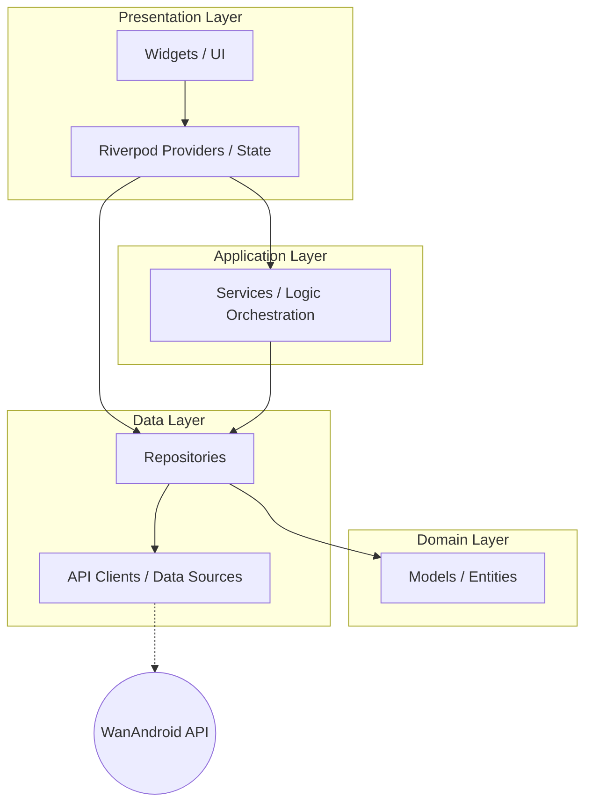

# WanAndroid Flutter

本项目是学习 [Code with Andrea](https://codewithandrea.com/articles/flutter-app-architecture-riverpod-introduction/) 推荐的 Flutter 应用架构（分层设计）的实战练习项目。主要目的是在 [玩安卓 (WanAndroid)](https://www.wanandroid.com/) 提供的公开 API 业务场景下，实践基于 Riverpod 的模块化与分层架构。

此外，本项目会**激进地跟进 Flutter SDK 及核心依赖库的最新版本**（包括 Alpha/Beta 版本），旨在验证新技术和新特性的可行性与兼容性。

## 🚀 特性

- **分层架构实践**：严格遵循 Data, Domain, Application, Presentation 分层逻辑。
- **全平台支持**：支持 Android, iOS, Web, Windows, macOS 以及 Linux。
- **响应式状态管理**：使用 **Riverpod 3 (Alpha)** 结合代码生成，实现强类型、自动释放的状态管理。
- **类型安全路由**：基于 **GoRouter** 配合 `go_router_builder` 实现声明式路由。
- **完善的网络层**：基于 **Dio** 封装，支持 Cookie 持久化及拦截器。
- **交互体验**：内置下拉刷新（EasyRefresh）、日志监控（Talker）以及沉浸式 WebView。

## 🛠️ 技术栈

| 类别 | 技术方案 |
| --- | --- |
| **基础框架** | Flutter (SDK >= 3.38.4) |
| **状态管理** | Riverpod 3.x, Riverpod Generator |
| **路由导航** | GoRouter 17.x, GoRouter Builder |
| **网络请求** | Dio 5.x, CookieJar |
| **数据持久化** | Path Provider (基础配置) |
| **日志监控** | Talker |
| **UI 组件** | EasyRefresh, CachedNetworkImage, WebView Flutter |

## 📂 项目结构

```text
lib/
├── common/             # 通用组件、Mixin 和工具类
│   ├── pagination/     # 分页逻辑抽象
│   └── widgets/        # 自定义通用 UI 组件
├── feature/            # 业务功能模块
│   ├── home/           # 首页模块
│   ├── media_platform/ # 公众号模块
│   ├── project/        # 项目分类模块
│   ├── square/         # 广场模块
│   └── profile/        # 个人中心
├── routers/            # 路由配置与生成
├── services/           # 基础设施服务（网络、存储、错误处理）
└── main.dart           # 应用入口
```

## 🏛️ 架构设计

项目遵循 **Code with Andrea** 提出的分层架构模式，通过 Riverpod 建立单向数据流。

### 架构示意图



### 分层职责

| 层次 (Layer) | 目录参考 | 职责说明 |
| :--- | :--- | :--- |
| **Presentation** | `lib/feature/.../presentation/` | 负责 UI 展示（Widgets）与状态管理（Providers），响应用户交互。 |
| **Application** | `lib/feature/.../application/` | **可选层**。负责协调多个 Repositories 的复杂业务逻辑或服务。 |
| **Domain** | `lib/services/network/data` | 纯 Dart 逻辑，定义业务模型（Models）与实体，不依赖 Flutter。 |
| **Data** | `lib/feature/.../data/` | 负责数据获取。包含 Repositories 接口实现及数据源（API/Local DB）。 |

## 🏁 快速开始

### 前置要求

项目推荐使用 [FVM](https://fvm.app/) 进行 Flutter 版本管理。

1. **安装依赖**：
   ```bash
   fvm flutter pub get
   ```

2. **生成代码**（Riverpod & GoRouter）：
   ```bash
   fvm flutter pub run build_runner build --delete-conflicting-outputs
   ```

3. **运行项目**：
   ```bash
   fvm flutter run
   ```

## 📌 TODO

- [ ] 完善各层级的单元测试（Unit Tests）
- [ ] 增加集成测试（Integration Tests）验证核心链路
- [ ] 探索 Golden Tests 视图回归测试

## 📝 许可证

本项目遵循开源许可证，详情请参阅 `LICENSE`。
